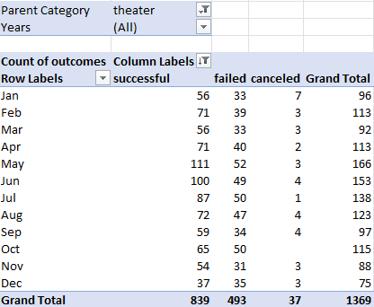
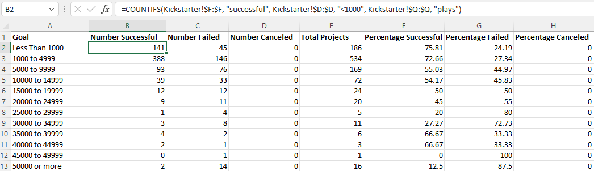
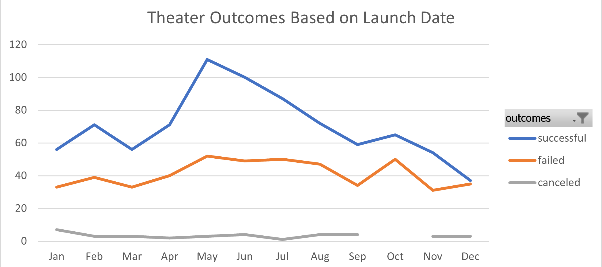
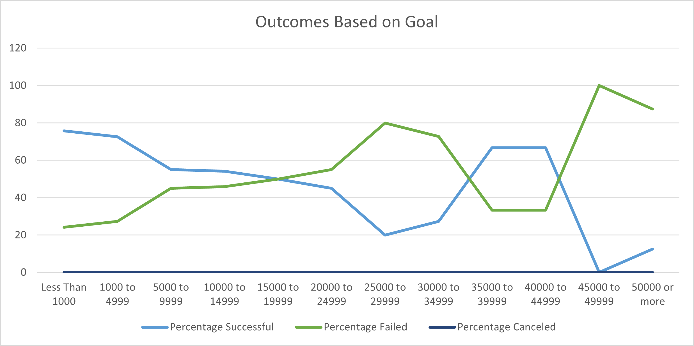

# Kickstarter

Overview of Project

The purpose of this analysis is to track how different kickstarter fundraisers performed based on their launch date and fundraising goal. The client specifically wanted to look at kickstarters that were Theater focused, and even more narrowly wanted to look at the performance of Plays, a sub category to Theater. The client had just done a kickstarter for her play that almost reached its goal, and wants more information before trying again with a new project.

Analysis and Challenges

The first thing we wanted to establish is if timing has a factor on theater based kickstarters. Generating a pivot table from a large dataset including thousands of kickstarters, we filtered theater kickstarters by their outcome month by month.

Very quickly we realized that cancelled kickstarters were mostly going to be a non-factor in our conclusions, but their data is included for posterity.

Looking at the list of those that were succesful, failed, or cancelled, we generated a line graph based on the data in order to further display the results in an easier to grasp format. This table will be discussed in the results section.

Going one step further we decided to us the COUNTIFS function of excel to provide us with a comprehensive list of kickstarters for plays and their success based on goal for fundraising. 

Once this data was pulled, we ran a calculation to express the data as a percentage based on the goal. 

In order to further show the trends for this data, we generated a table for it as well showing the results expressed as a line graph. This table again will be discussed in the results section of this report

Challenges

With many ways to potentially interpret the data, we decided it would be best to focus on easily defined areas; timing and goal. Many of the difficulties were around how to find the best formatting method to show what the real trends were. Running the outcomes based on launch date by quarter or year, for instance, would not have produced nearly good enough data for a realistic conclusion.

In the same way we approached the outcomes based on goal study; in the interest of time we calculated in range of 5000, but could easily see revisiting to run more precise outcome ranges, such as 2500 or 1000.

The coding used to arive at these conclusions was not incredibly difficult and most time was spent on formatting to make sure the information was displayed in a way that corroborated the raw numbers.

Results

Clearly we can see that timing does affect theater kickstarters, with a large proportion being successfully founded in the summer months. This could possibly have to do with more families thinking about going to see plays with children over the summer vacation, or potentially some of the plays being funded at that time are outdoor plays that people would go to see in a park or an ampitheater. Further study on location proposed for these kickstarters may be in order. The succesful kickstarters for theater drop heavily before december, leading one to believe that with the holidays coming up people aren't looking to spend their money on intangible future things.

Based on this graph, kickstarters for plays asking for $15,000 or under have a fairly good chance of being funded, dropping off after that. There is a small spike in likelihood of meeting their goal shown between the $35,000 and $40,000 range, but given the sharp drop in likelihood immediately after this data may be suspect as it could be victim to having too small a sample size.

This shows that while there is a market for plays on kickstarter, those looking for high dollar backers may need to potentially re-tool their budget if they do not get the expected support on the strength of their concept.

This dataset is potentially limited though, because play kickstarters asking for above $25,000 have a very small sample size in this chart, and drawing hard conclusions based off this evidence may be misleading. 

Further studies that could be done that would help as well would be potentially looking at those theater/play kickstarters by genre and looking at the the data of that compared to the other data already contained in this report. For instance, it would be useful to see if those summer kickstarters were mostly dramas or comidies, for instance.

We hope you find this data analysis useful, and look forward to potentially revisiting it at a later date.